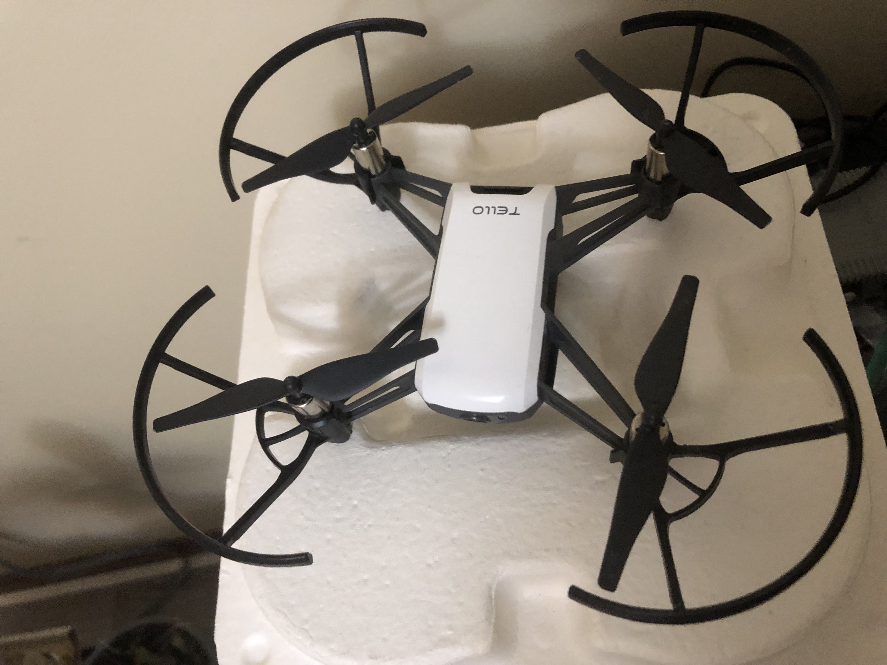

## Description

This repository contains DJI Tello drone's keyboard based remote controller, image capturer and a mapper which gives coordinates of the drone.   

## Setup Photos

### Drone

### Sample screens that pop up when you start any of the controllers or mapper 

## Requirements 
- Drone 
- Python libraries - pygame, tello, open-cv 

## Instructions to use it
### flying instructions to controle drone while using any feature
Press "t" for take off, "q" for landing, "w" to go up, "s" to go down, "a" and "d" to rotate 360 in either directions. "Front-key" to move forward, "down-key" to move back, "left-key" to move left and "right-key" to move right.

   - - To run remote controller run keyboard_control.py and follow flying instructions
     - To use image capturer run keyboardControlImageCapture.py, follow same flying instructions and press "z" to capture photos of any place/location you like
     - To use the mapper run mapping.py and follow same flying instructions 
